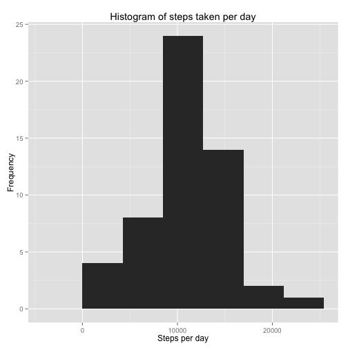
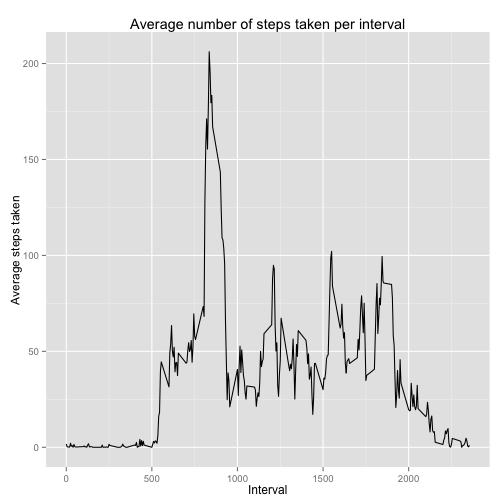
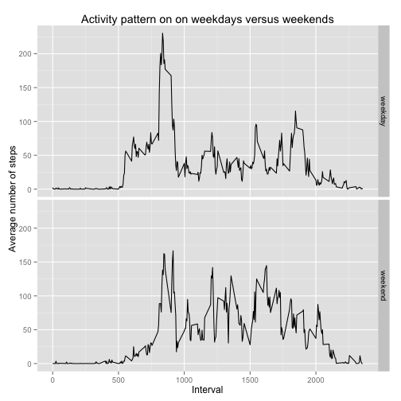

# Reproducible Research: Peer Assessment 1

## Loading the preprocessing the data ##

We unzip and load the data, downloaded from [the coursera website][data], and
then inspect it for sanity.


```r
unzip("activity.zip", overwrite = FALSE)
data <- read.csv(file = "activity.csv", colClasses = c("integer", "Date", "integer"))
summary(data)
```

```
##      steps            date               interval   
##  Min.   :  0.0   Min.   :2012-10-01   Min.   :   0  
##  1st Qu.:  0.0   1st Qu.:2012-10-16   1st Qu.: 589  
##  Median :  0.0   Median :2012-10-31   Median :1178  
##  Mean   : 37.4   Mean   :2012-10-31   Mean   :1178  
##  3rd Qu.: 12.0   3rd Qu.:2012-11-15   3rd Qu.:1766  
##  Max.   :806.0   Max.   :2012-11-30   Max.   :2355  
##  NA's   :2304
```


We extract two data frames representing the number of steps per day and the mean
steps per time interval.


```r
stepsPerDay <- aggregate(steps ~ date, data = data, sum, na.rm = TRUE)
stepsPerDay <- data.frame(stepsPerDay)

meanStepsPerInterval <- aggregate(steps ~ interval, data = data, mean, na.rm = TRUE)
meanStepsPerInterval <- data.frame(meanStepsPerInterval)
```


## What is the mean total number of steps taken per day? ##

We use ggplot2 to create a histogram of the average number of steps taken per
day.


```r
library(ggplot2)
qplot(x = steps, data = stepsPerDay, binwidth = max(stepsPerDay$steps)/5, main = "Histogram of steps taken per day", 
    xlab = "Steps per day", ylab = "Frequency")
```

 


The **mean** number of steps per day is **10766**, and the **median** number of
steps per day is **10765**.  This was found using the code below, but can also
be found by calling `summary(stepsPerDay)`.


```r
mean(stepsPerDay$steps)
```

```
## [1] 10766
```

```r
median(stepsPerDay$steps)
```

```
## [1] 10765
```


## What is the average daily activity pattern? ##

We make a time series plot of the 5-minute interval and the
average number of steps taken, averaged across all days.


```r
library(ggplot2)
ggplot(meanStepsPerInterval, aes(x = interval, y = steps)) + geom_line() + ggtitle("Average number of steps taken per interval") + 
    xlab("Interval") + ylab("Average steps taken")
```

 


The five-minute interval starting at **835** represents the most active time,
with ***206.1698*** steps on average.  This was found by calling the code below


```r
meanStepsPerInterval[which.max(meanStepsPerInterval$steps), ]
```

```
##     interval steps
## 104      835 206.2
```


## Imputing missing values ##

The total number of missing values in the dataset is **2304**.  This was found
by running the code below, though it an also be found by calling
`summary(data)`.


```r
sum(is.na(data$steps))
```

```
## [1] 2304
```


We replace all NA values in `data$steps` with the mean number of steps per
corresponding interval.


```r
getMeanSteps <- function(interval) {
    meanStepsPerInterval[which(meanStepsPerInterval$interval == interval), ]$steps
}
for (i in 1:length(data$steps)) {
    data$steps[i] <- ifelse(is.na(data$steps[i]), getMeanSteps(data$interval[i]), 
        data$steps[i])
}
```


We check that there are no more NA values in `data$steps`


```r
any(is.na(data$steps))
```

```
## [1] FALSE
```


## Are there differences in activity patterns between weekdays and weekends? ##

We create a new factor variable in the dataset with two levels---"weekday"" and
"weekend".


```r
weekday <- weekdays(data$date)
type <- ifelse(weekday == "Saturday" | weekday == "Sunday", "weekend", "weekday")
type <- factor(type)
```


We use ggplot1 to make a panel plot containing a time series plot of the
5-minute interval and the average number of steps taken, averaged
across all weekday days or weekend days.


```r
library(ggplot2)
library(plyr)
df <- ddply(.data = data.frame(data$steps), .variables = .(data$interval, type), 
    colwise(mean))
names(df) <- c("interval", "type", "stepsPerInterval")
ggplot(df, aes(x = interval, y = stepsPerInterval, xlab = "Interval")) + geom_line() + 
    facet_grid(type ~ .) + ggtitle("Activity pattern on on weekdays versus weekends") + 
    xlab("Interval") + ylab("Average number of steps")
```

 


[data]: https://d396qusza40orc.cloudfront.net/repdata%2Fdata%2Factivity.zip
