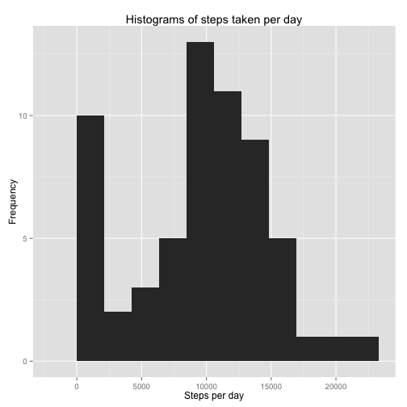
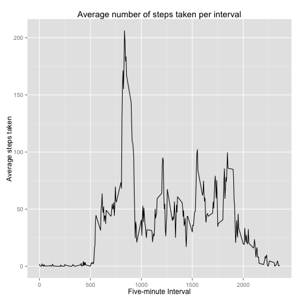
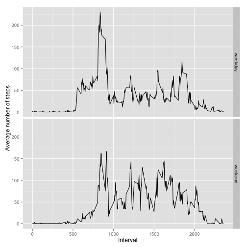

Peer Assessment 1
========================================================

## Introduction ##

It is now possible to collect a large amount of data about personal movement
using activity monitoring devices such as a [Fitbit][fitbit], [Nike
Fuelband][fuelband], or [Jawbone][jawbone] Up. These type of devices are part of
the “quantified self” movement – a group of enthusiasts who take measurements
about themselves regularly to improve their health, to find patterns in their
behavior, or because they are tech geeks. But these data remain under-utilized
both because the raw data are hard to obtain and there is a lack of statistical
methods and software for processing and interpreting the data.

This assignment makes use of data from a personal activity monitoring device.
This device collects data at 5 minute intervals through out the day. The data
consists of two months of data from an anonymous individual collected during the
months of October and November, 2012 and include the number of steps taken in 5
minute intervals each day.

## Data ##

The data for this assignment was downloaded from the course web site on Wed May  7 23:43:02 2014

* Dataset: [Activity monitoring data][data]

The variables included in this dataset are:

* steps: Number of steps taking in a 5-minute interval (missing values are coded as NA)

* date: The date on which the measurement was taken in YYYY-MM-DD format

* interval: Identifier for the 5-minute interval in which measurement was taken

The dataset is stored in a comma-separated-value (CSV) file and there are a
total of 17,568 observations in this dataset.

## Loading the preprocessing the data ##

We load the data and replace the date column with Date objects.


```r
data <- read.csv(file = "activity.csv")
data$date <- as.Date(data$date)
```


## What is the mean total number of steps taken per day? ##
We use ggplot2 to create a histogram of the average number of steps taken per day.


```r
library(ggplot2)
numBins <- 10
stepsPerDay <- tapply(data$steps, data$date, sum, na.rm = TRUE)
stepsPerDay <- data.frame(stepsPerDay)
names(stepsPerDay) <- c("steps")
qplot(steps, data = stepsPerDay, binwidth = max(stepsPerDay)/numBins, main = "Histograms of steps taken per day", 
    xlab = "Steps per day", ylab = "Frequency")
```

 


The **mean** number of steps per day is **9354.23**, and the **median** number of
steps per day is **10395**.  This was found using the code below, but can also be found by calling `summary(stepsPerDay)`.


```r
mean(stepsPerDay$steps)
```

```
## [1] 9354
```

```r
median(stepsPerDay$steps)
```

```
## [1] 10395
```


## What is the average daily activity pattern? ##

We make a time series plot of the 5-minute interval and the
average number of steps taken, averaged across all days.


```r
library(ggplot2)
meanStepsPerInterval <- tapply(data$steps, data$interval, mean, na.rm = TRUE)
interval <- as.numeric(rownames(meanStepsPerInterval))
df <- data.frame(interval, meanStepsPerInterval)
ggplot(df, aes(x = interval, y = meanStepsPerInterval)) + geom_line() + ggtitle("Average number of steps taken per interval") + 
    xlab("Five-minute Interval") + ylab("Average steps taken")
```

 


The five-minute interval starting at **835** represents the most active time.  This was found by calling the code below


```r
which.max(df$meanStepsPerInterval)
```

```
## 835 
## 104
```


## Inputing missing values ##

The total number of missing values in the dataset is **2304**.  This was found by running the code below, though it an also be found by calling `summary(data)`.


```r
sum(is.na(data$steps))
```

```
## [1] 2304
```


We replace all NA values in `data$steps` with the mean number of steps per
corresponding interval.


```r
for (i in 1:length(data$steps)) {
    data$steps[i] <- ifelse(is.na(data$steps[i]), meanStepsPerInterval[as.character(data$interval[i])], 
        data$steps[i])
}
```


## Are there differences in activity patterns between weekdays and weekends? ##

We create a new factor variable in the dataset with two levels---"weekday"" and
"weekend".


```r
weekday <- weekdays(data$date)
type <- ifelse(weekday == "Saturday" | weekday == "Sunday", "weekend", "weekday")
type <- factor(type)
```


We use ggplot1 to make a panel plot containing a time series plot of the
5-minute interval and the average number of steps taken, averaged
across all weekday days or weekend days.


```r
library(plyr)
df <- ddply(.data = data.frame(data$steps), .variables = .(data$interval, type), 
    colwise(mean))
names(df) <- c("interval", "type", "stepsPerInterval")
ggplot(df, aes(x = interval, y = stepsPerInterval)) + geom_line() + facet_grid(type ~ 
    .) + xlab("Interval") + ylab("Average number of steps")
```

 


## Summary ##

Blah blah blah.

[fitbit]: http://www.fitbit.com
[fuelband]: http://www.nike.com/us/en_us/c/nikeplus-fuelband
[jawbone]: https://jawbone.com/up
[data]: https://d396qusza40orc.cloudfront.net/repdata%2Fdata%2Factivity.zip
